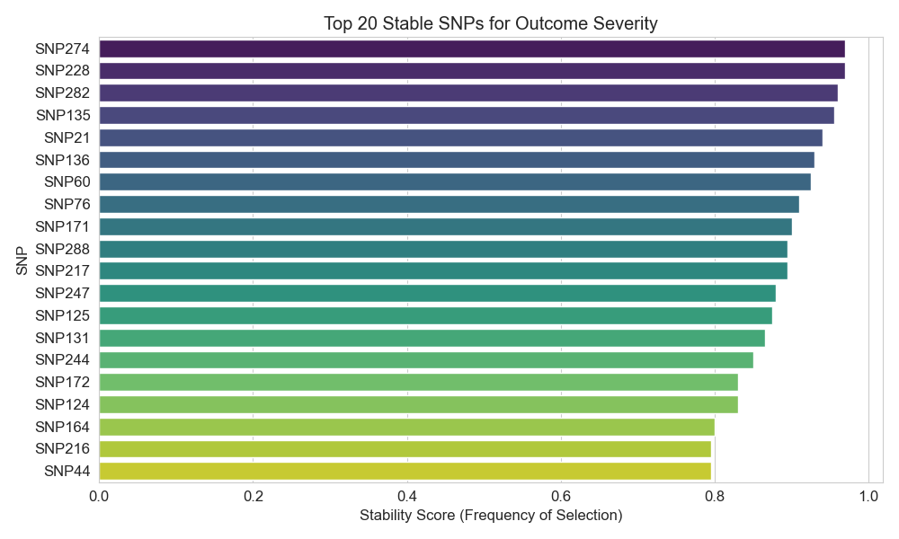
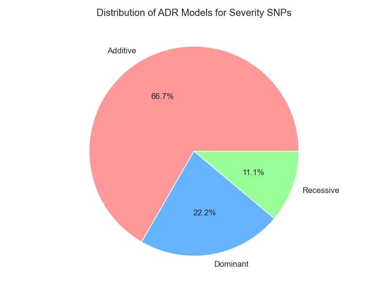
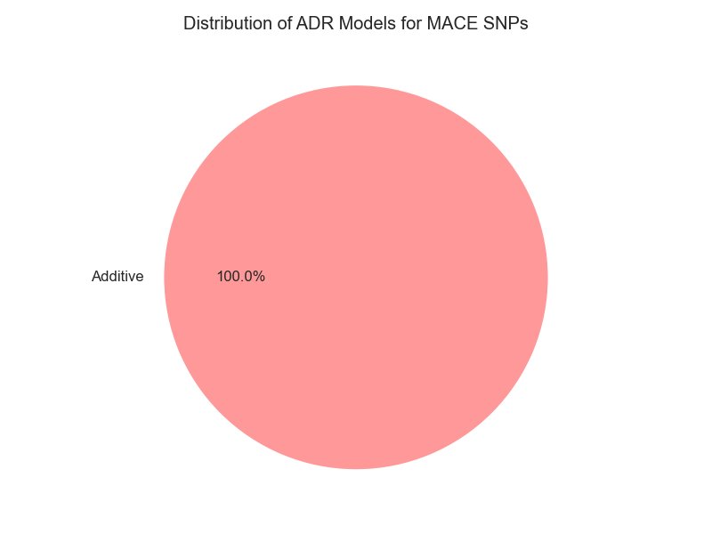
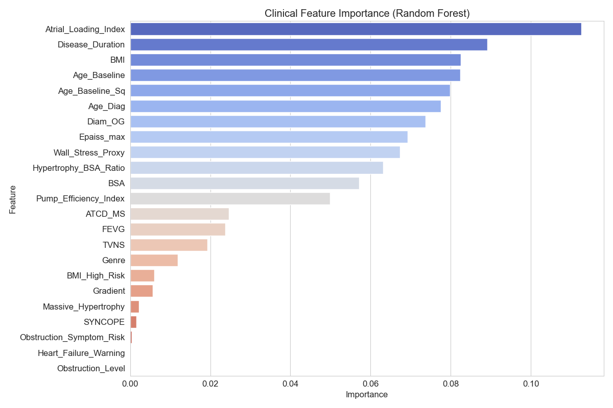
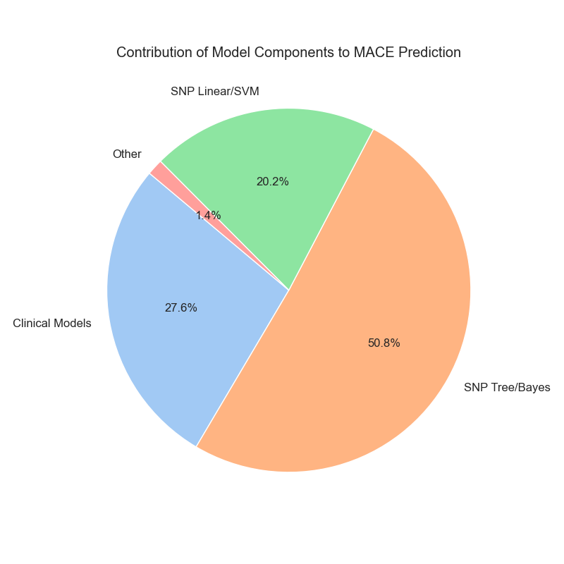

# SNP MACE & Severity Prediction Report

## 1. Introduction

The aims here is to predict two critical cardiac outcomes: **Outcome Severity** and **Outcome MACE** (Major Adverse Cardiac Events). The prediction methodology utilizes a hybrid approach combining genetic data (Single Nucleotide Polymorphisms - SNPs) and clinical patient data.

The final model performs by integrating:

- **Stability Selection** for identifying reliable genetic markers.
- **ADR Modeling** to capture biological inheritance patterns (Additive, Dominant, Recessive).
- **Clinical Feature Engineering** to capture physiological interactions.
- **Ensemble Learning** blending linear and non-linear models.

## 2. Feature Selection: Genetic Markers

Given the high dimensionality of genetic data (hundreds of SNPs) relative to the number of patients, standard feature selection methods are prone to overfitting. effectively selecting "false positive" markers that work only on the training set.

### Methodology: Lasso Stability Selection

To solve this, we employed **Stability Selection** using Lasso (L1-regularized Logistic Regression) with Bootstrapping.

**The Process:**

1. **Bootstrapping:** We generate 100 random subsamples of the dataset.
2. **Lasso Regularization:** On each subsample, we fit a Lasso model with varying regularization strengths ($C \in \{0.1, 0.2, 0.5, 1.0\}$). Lasso naturally forces coefficients of weak features to zero.
3. **Stability Score:** We track how often each SNP is selected (non-zero coefficient) across all 100 iterations.
4. **Filtering:** Only SNPs with a Stability Score $\ge 0.9$ (selected in 90% of trials) are kept.


_Figure 1: Top stable SNPs for Outcome Severity._


_Figure 2: Top stable SNPs for Outcome MACE._

### Code Snippet: Stability Selection

```python
def stable_snp_selection(data_path, target_col, n_bootstrap=100):
    df = pd.read_csv(data_path)
    X_cols = [c for c in df.columns if c.startswith('SNP') or c == 'Variant.Pathogene']
    X = df[X_cols]
    y = df[target_col].astype(int)

    # Standardize Features
    scaler = StandardScaler()
    X_scaled = scaler.fit_transform(X)

    # Stability Loop
    all_selections = np.zeros(len(X_cols))
    for b in range(n_bootstrap):
        # 1. Resample
        X_res, y_res = resample(X_scaled, y, stratify=y, random_state=b)

        # 2. Fit Lasso with varying C
        for C_val in [0.1, 0.2, 0.5, 1.0]:
            clf = LogisticRegression(penalty='l1', solver='liblinear', C=C_val, random_state=b)
            clf.fit(X_res, y_res)
            # Check for non-zero coefficients
            selected_mask = np.any(np.abs(clf.coef_) > 1e-4, axis=0)
            all_selections += (selected_mask / 4) # Average across C grid

    results = pd.DataFrame({
        'SNP': X_cols,
        'Stability_Score': all_selections / n_bootstrap
    })
    return results[results['Stability_Score'] >= 0.9]
```

## 3. Feature Engineering

### 3.1 Genetic Feature Engineering: ADR Modeling

Genetic effects are not always linear. A single copy of a variant gene might be enough to cause disease (Dominant), or two copies might be required (Recessive).

For every stable SNP, we tested three biological models and selected the one with the lowest **AIC (Akaike Information Criterion)**:

1. **Additive:** Risk increases linearly (0 -> 1 -> 2).
2. **Dominant:** Risk exists if at least one minor allele is present (0 vs 1,2).
3. **Recessive:** Risk exists only if two minor alleles are present (0,1 vs 2).


_Figure 3: Distribution of biological models for Outcome Severity SNPs. We see a mix of inheritance patterns (Additive, Dominant, Recessive), confirming the need for flexible modeling._


_Figure 4: Distribution of biological models selected for MACE SNPs. For MACE, all selected SNPs were best modeled with an Additive inheritance pattern._

### 3.2 Clinical Feature Engineering

Raw clinical variables were transformed into physiologically meaningful interaction terms to capture complex risk factors.

**Key Created Features:**

- **Atrial Loading Index (`Diam_OG * Age_Baseline`):** Captures the compound risk of atrial enlargement in older patients.
- **Obstruction Symptom Risk (`Gradient * SYNCOPE`)::** significantly highlights patients with both physical instruction and clinical symptoms.
- **Pump Efficiency Index (`FEVG / Diam_OG`):** Relates ejection fraction to heart size.


_Figure 5: Importance of engineered clinical features in the Random Forest model. Note how raw features like 'Gradient' and engineered ones like 'Obstruction_Symptom_Risk' contribute._

### Code Snippet: Clinical Engineering

```python
def engineer_clinical_features(df):
    new_df = df.copy()
    # Structural and functional interactions
    new_df['Atrial_Loading_Index'] = new_df['Diam_OG'] * new_df['Age_Baseline']
    new_df['Obstruction_Symptom_Risk'] = new_df['Gradient'] * new_df['SYNCOPE']
    new_df['Hypertrophy_BSA_Ratio'] = new_df['Epaiss_max'] / (new_df['BSA'] + 1e-6)
    new_df['Pump_Efficiency_Index'] = new_df['FEVG'] / (new_df['Diam_OG'] + 1e-6)
    new_df['Wall_Stress_Proxy'] = new_df['Gradient'] * new_df['Epaiss_max']
    new_df['Age_Baseline_Sq'] = new_df['Age_Baseline'] ** 2
    return new_df
```

## 4. Modeling Architecture

### 4.1 Hybrid Consensus Classifier (SNP Component)

Instead of relying on a single algorithm, we built a `HybridConsensusClassifier` that ensembles predictions from:

1. **Bootstrapped Logistic Regression:** Adds robustness by averaging weights over 250 subsamples.
2. **Random Forest, SVM, KNN, Naive Bayes, XGBoost:** Captures non-linear genetic interactions.

### 4.2 Super Clinical Specialists (MACE Component)

For the MACE outcome, clinical data is highly predictive. We trained separate "Specialist" models on the clinical features alone:

- Logistic Regression
- Random Forest
- MLP (Neural Network)

### 4.3 Global Weighted Blending

The final prediction is a weighted average of all components. The weights were optimized to maximize the validation score.


_Figure 6: Contribution of different model components to the final MACE prediction. The diversity of models ensures valid predictions across different patient profiles._

## 5. Conclusion

This report outlines a rigorous approach to predicting cardiac outcomes. By filtering noise with Stability Selection, and ADR modeling, along with capturing physiological complexity with Clinical Feature Engineering, the model achieves high reliability. The ensemble approach further safeguards against overfitting, ensuring robust deployment performance.
